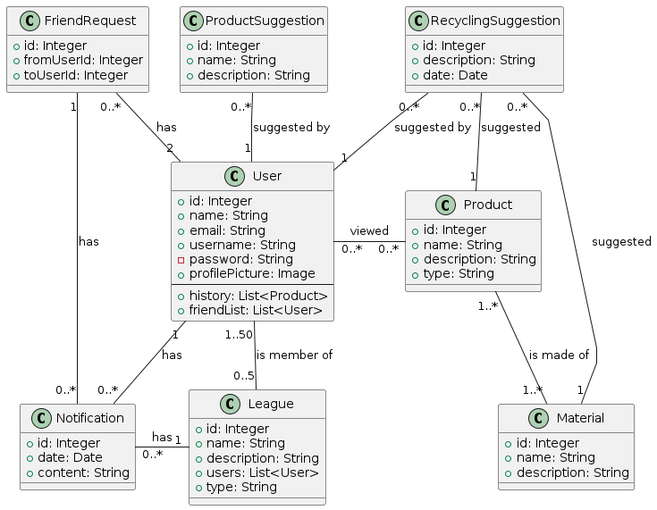
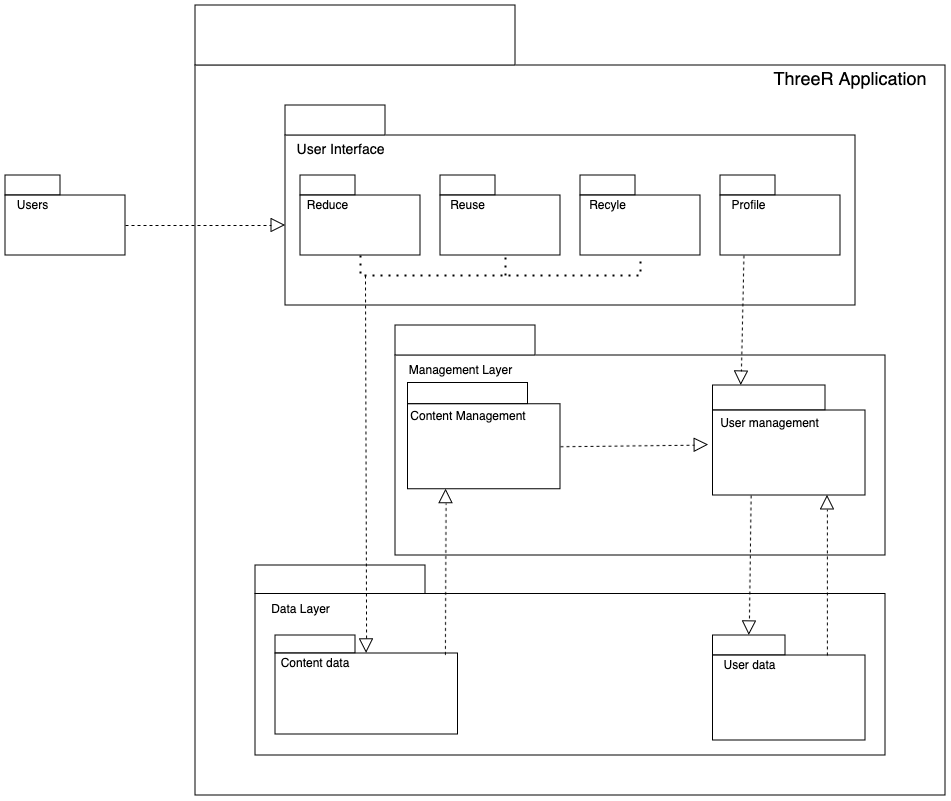
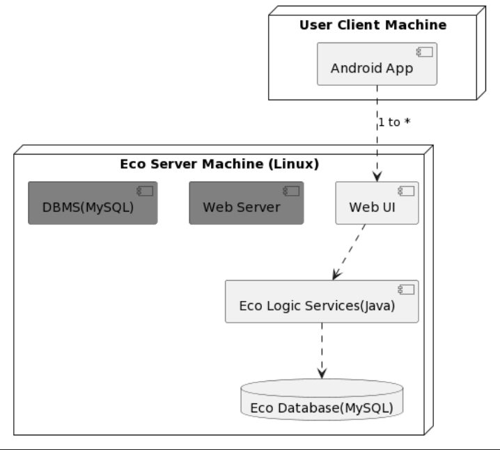
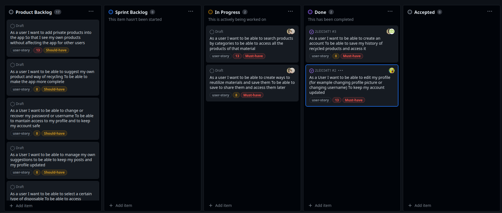
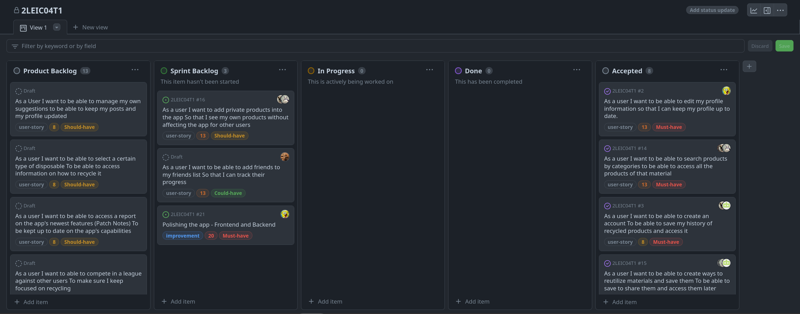
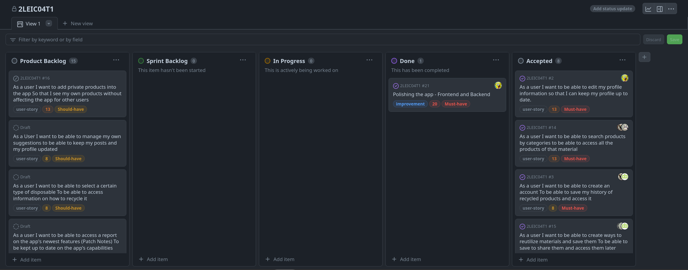

# TreeR Development Report

Welcome to the documentation pages of the TreeR app!

You can find here details about the TreeR, from a high-level vision to low-level implementation decisions, a kind of Software Development Report, organized by type of activities: 

* [Business modeling](#Business-Modelling) 
  * [Product Vision](#Product-Vision)
  * [Elevator Pitch](#Elevator-pitch)
* [Requirements](#Requirements)
  * [Domain Model](#Domain-Model)
* [Architecture and Design](#Architecture-And-Design)
  * [Logical architecture](#Logical-Architecture)
  * [Physical architecture](#Physical-Architecture)
* [Project management](#Project-Management)

Contributions are expected to be made exclusively by the initial team, but we may open them to the community, after the course, in all areas and topics: requirements, technologies, development, experimentation, testing, etc.

Please contact us!

Thank you!

Bruno Moreira up202107143@up.pt 
Afonso Neves up202108884@up.pt  
João Proença up202207835@up.pt  
Gonçalo Sampaio up202206636@up.pt 
Tiago Santos up202207073@up.pt 

---
## Business Modelling

### Product Vision

Allow users to reduce, reuse and recycle their waste and share their knowledge with others about it while keeping track of their history of their achievements and receiving suggestions of new ways or material / items to recycle.

### Elevator Pitch

Recycling isn't just eco-friendly—it's about to become your new favorite activity! With 'ThreeR,' we're transforming the way you view sustainability. This app doesn't just educate; it turns saving the planet into a social, rewarding experience. It will feature daily tips to reduce consumption and waste, a recipe maker for you to share fun ways to reuse items and a comprehensive recycling guide, so it will embody the three Rs of sustainability. Join us in this green journey to save the planet and have fun doing it!

## Requirements

In this section, it is documented the requirements of the system, both functional and non-functional.

### Domain Model

Our domain model consists of the following entities:

- `User`: Represents a person who uses the app. Each **User** has a unique username and can have a profile picture. It contains a list of **Friends** that the user has, as well as the **User**'s browsing history in the app.

- `Notification`: Represents a notification that is sent to a **User**. Its content varies depending on the event that triggered it.

- `FriendRequest`: Represents a friend request sent from one **User** to another.

- `Material`: Represents a material that composes a product. It contains a list of instructions on how to recycle it.

- `Product`: Represents a product in the app. It contains a list of **Materials** that compose it, as well as a list of instructions on how to recycle it.

- `ProductSuggestion`: Represents a suggestion submitted by a **User** for a **Product** to be added to the app. It will be reviewed by an admin before being added to the app in the next update.

- `RecyclingSuggestion`: Represents a suggestion submitted by a **User** on how to recycle a **Product** or **Material**. It will be reviewed by an admin before being added to the app in the next update.

- `League`: Represents a league in the app, where users can compete against each other to earn points and climb the leaderboard. It contains a list of **Users** who are part of the league. It can be public or private.

## Architecture and Design

### Logical architecture

### Physical architecture

## Project Management

### Sprint 1 Retrospective

#### Product Backlog

#### Retrospective

After this sprint we have figured out that, ealthough the foundations of the project are well established, namely when it comes to creating an account, logging in/out, and changing the profile itself, the inconsistent delineation between us and each part of our project ( divided into three parts, reduce, reuse and recycle ) was a reason for a loss of efficiency, and in the planning of sprint 2 it will be defined in a better way so that we can start finding ways to implement our vision in a uniform way. Basically, in sprint 2 we will define the abstractions that we will give to the data that users will create (namely information in relation to the 3 Rs) and will consume.

### Sprint 3 Retrospective

#### Product Backlog

#### Retrospective

In this final sprint, our primary focus was on polishing the app and ensuring it is ready for a stable release. Although no major features were introduced during this period, we concentrated on refining the existing functionalities and enhancing the overall user experience. The primary changes were the added unit and acceptance tests, and reworking most pages and classes for better code readability and more efficient features and aesthetics.
